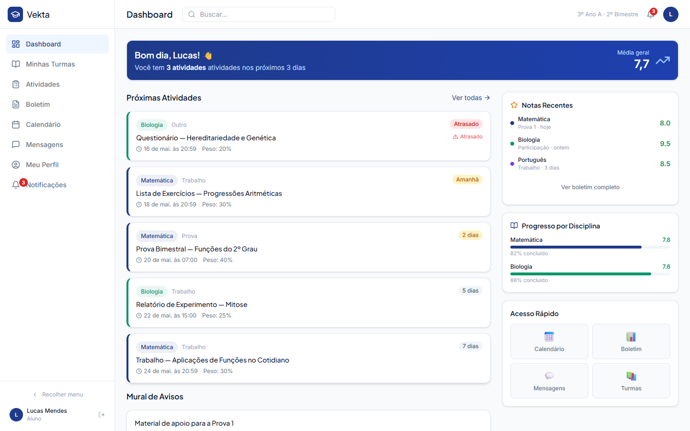
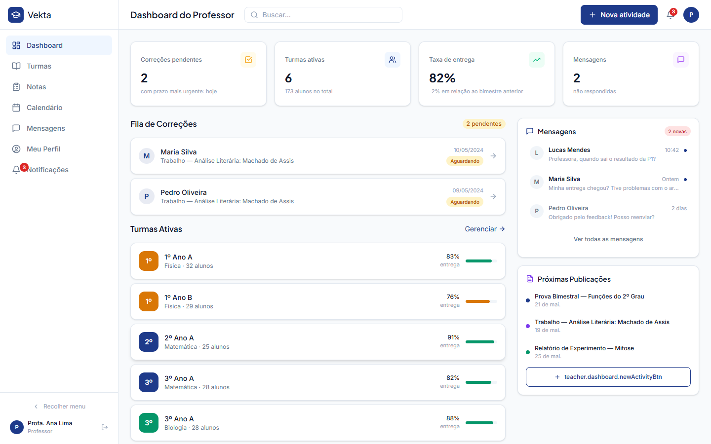
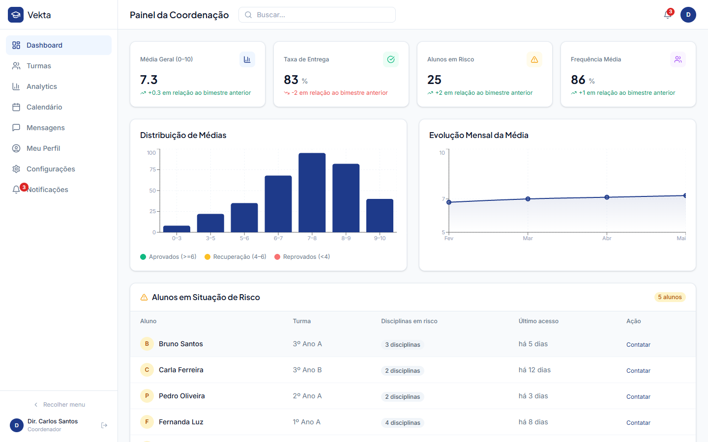
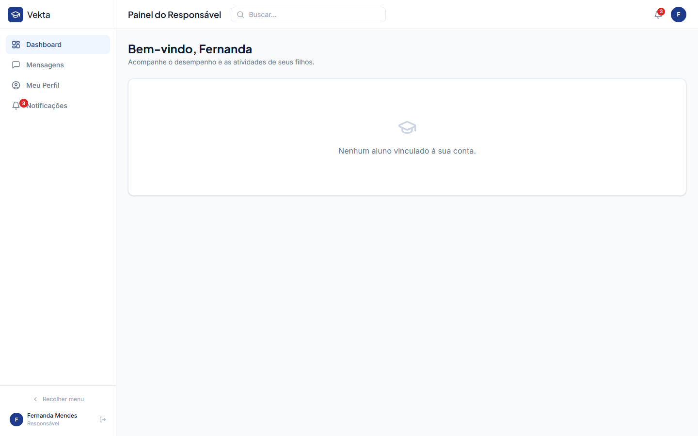
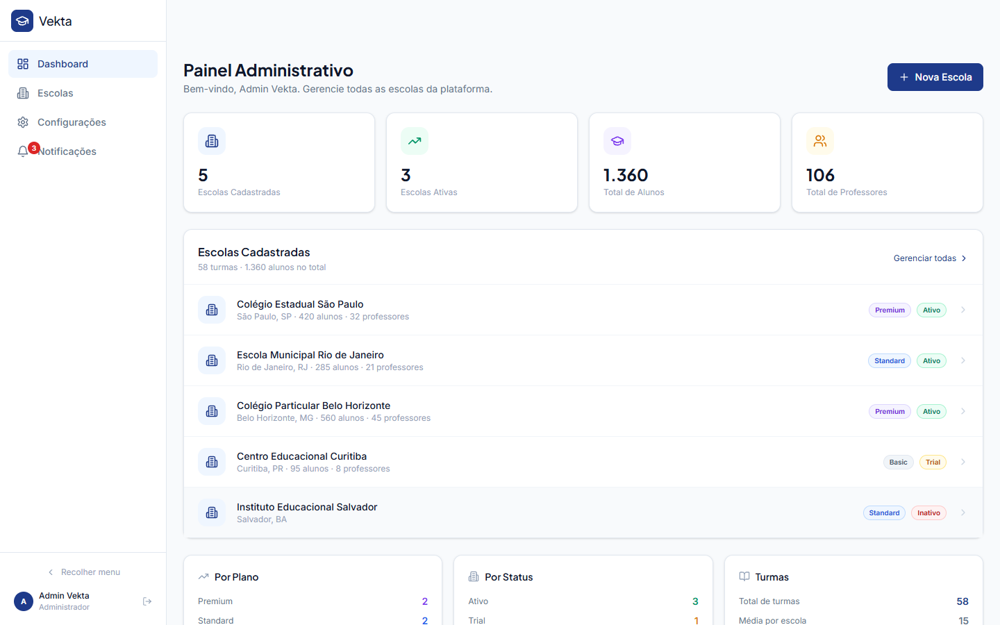

<div align="center">

# Vekta — Plataforma Educacional Completa

[](https://opensource.org/licenses/MIT)
[](https://nodejs.org)
[](https://reactjs.org)
[](https://www.typescriptlang.org)
[](https://supabase.com)

**Sistema de gestão escolar full-stack com autenticação real, multi-perfil e internacionalização.**  
Alunos, professores, coordenadores, responsáveis e administradores — tudo em um só lugar.

</div>

---

## Por que Vekta?

| | Diferencial |
|---|---|
| 👥 **Multi-perfil nativo** | 5 painéis completamente distintos (aluno, professor, coordenador, responsável, admin) — cada um com sua própria navegação, rotas e regras de acesso |
| 🌍 **Internacionalização completa** | Interface disponível em Português, Inglês e Espanhol, com troca de idioma em tempo real — pronto para mercados internacionais |
| 🔐 **Autenticação real** | Login com Supabase Auth + JWT, sessão persistente, Row Level Security no banco — não é demo, é produção |
| 🏫 **Multi-tenant** | Suporte a múltiplas escolas desde a arquitetura — cada escola isolada, com seu próprio conjunto de turmas, usuários e dados |
| ⚡ **Stack moderna e escalável** | React 18 + TypeScript + Node.js + PostgreSQL. Código limpo, sem dependências pesadas, fácil de customizar e estender |
| ✨ **UX de nível produção** | Skeleton loaders, empty states com SVG, tema claro/escuro, página 404 personalizada e acesso rápido com 1 clique |

---

## Screenshots

> **Para compradores:** substitua os placeholders abaixo pelos prints reais do sistema.  
> Consulte [`docs/screenshots/README.md`](docs/screenshots/README.md) para instruções detalhadas.

### 🎓 Dashboard do Aluno


### 👩‍🏫 Dashboard do Professor


### 📊 Dashboard do Coordenador


### 👨‍👩‍👧 Painel do Responsável


### ⚙️ Painel Administrativo


---

## Demonstração rápida

Todos os 5 perfis estão disponíveis como **botões de 1 clique** na tela de login — cada botão já exibe o e-mail da conta:

| Perfil | E-mail | Senha | O que pode ver |
|---|---|---|---|
| 🎓 Aluno | `lucas@escola.vekta.app` | `Demo@2025#` | Turmas, atividades, boletim, calendário |
| 👩‍🏫 Professor | `ana.lima@escola.vekta.app` | `Demo@2025#` | Turmas, lançamento de notas, correção |
| 📊 Coordenador | `carlos@escola.vekta.app` | `Demo@2025#` | Analytics, visão geral das turmas |
| 👨‍👩‍👧 Responsável | `fernanda.mendes@gmail.com` | `Demo@2025#` | Desempenho e atividades dos filhos |
| ⚙️ Administrador | `admin@vekta.app` | `Vekta@2025#Admin` | Multi-escola, KPIs da plataforma |

---

## Funcionalidades

### 🎓 Aluno

| | Funcionalidade |
|---|---|
| 📋 | Dashboard com resumo de notas, atividades pendentes e calendário |
| 🏫 | Visualização de turmas matriculadas e mural de avisos |
| 📤 | Entrega de atividades com upload de arquivos |
| 📊 | Boletim completo (notas numéricas e por menção) |
| 📅 | Calendário de provas e entregas com contagem regressiva |

### 👩‍🏫 Professor

| | Funcionalidade |
|---|---|
| 🏫 | Gerenciamento de turmas com visão de desempenho |
| ➕ | Criação e publicação de atividades para múltiplas turmas |
| 🔢 | Lançamento de notas: sistema numérico e por menção/objetivos |
| ✅ | Fila de correção de entregas com feedback por aluno |
| 📢 | Publicação de avisos e materiais no mural da turma |
| 👤 | Matrícula de alunos por e-mail com confirmação visual prévia |
| 🗑️ | Remoção de aluno com diálogo de confirmação (evita exclusões acidentais) |

### 📊 Coordenador

| | Funcionalidade |
|---|---|
| 📈 | Analytics de desempenho por turma e disciplina |
| ⚠️ | Lista de alunos em risco com acesso rápido |
| 📉 | Gráficos de distribuição de notas e evolução mensal |
| 🏫 | Visão consolidada de todas as turmas da escola |
| ➕ | Criação de turmas com série, disciplina personalizada e lista pesquisável de professores |
| 🎨 | Picker de cor ao criar disciplinas novas |
| 🗓️ | Bimestre e ano letivo calculados automaticamente pela data atual |

### 👨‍👩‍👧 Responsável

| | Funcionalidade |
|---|---|
| 👀 | Acompanhamento em tempo real do desempenho dos filhos |
| 📊 | Boletim detalhado por disciplina com histórico bimestral |
| 📅 | Frequência por matéria com alertas de mínimo |
| 📋 | Lista de atividades pendentes, próximas e atrasadas |

### ⚙️ Administrador

| | Funcionalidade |
|---|---|
| 🏫 | Gerenciamento de múltiplas escolas (multi-tenant) |
| ➕ | Cadastro de novas escolas com plano e status |
| 📊 | Dashboard com KPIs consolidados de toda a plataforma |
| 👥 | Visão de usuários e turmas por escola |

### 🌐 Recursos Gerais

| | Funcionalidade |
|---|---|
| 🔐 | Autenticação real via Supabase Auth + JWT com sessão persistente |
| 🌍 | Internacionalização: Português, Inglês e Espanhol |
| 🔔 | Sistema de notificações em tempo real (painel lateral) |
| 💬 | Mensagens diretas entre usuários |
| 🎨 | Personalização de perfil: foto, cor do avatar, senha |
| 📱 | Design responsivo (mobile-first) |
| 📌 | Barra lateral colapsável com navegação por papel |
| 🌙 | Tema claro/escuro com toggle no header e na tela de login, persistência em `localStorage` |
| 💀 | Skeleton loaders em todos os dashboards e listas durante o carregamento |
| 📭 | Empty states com ação sugerida em cada página sem dados |
| 🔍 | Página 404 personalizada com redirecionamento inteligente por perfil |
| ⚡ | Acesso rápido no login: 5 perfis demo com 1 clique |
| 📲 | Barra de navegação inferior no mobile (bottom nav) com ícone ativo destacado |
| ⌨️ | Atalho `Cmd+K` / `Ctrl+K` para focar a busca global; `Esc` para limpar e sair |
| ⬆️ | Scroll automático ao topo a cada mudança de rota |
| 🔔 | Badge de notificação com animação de entrada (bounce) no sidebar e no header |
| ✅ | `ConfirmDialog` reutilizável para qualquer ação destrutiva (suporte a Esc e estado de loading) |
| 📱 | Layout totalmente responsivo: grids colapsam em mobile, tabelas com scroll horizontal, modais ajustados |

---

## Stack

### Frontend

| Categoria | Tecnologia |
|---|---|
| Framework | React 18 + TypeScript |
| Build | Vite 5 |
| Estilização | Tailwind CSS 3 |
| Roteamento | React Router v6 |
| Estado global | Zustand |
| Data fetching | TanStack Query (React Query) |
| Gráficos | Recharts |
| Ícones | Lucide React |
| Utilitários | clsx, date-fns |

### Backend

| Categoria | Tecnologia |
|---|---|
| Banco de dados | PostgreSQL via Supabase |
| Autenticação | Supabase Auth + JWT |
| Autorização | Row Level Security (RLS) por escola e perfil |
| Cliente DB | Supabase JS Client (`@supabase/supabase-js`) |

---

## Rodando localmente

### Pré-requisitos

- Node.js 18+
- Conta gratuita no [Supabase](https://supabase.com)

### 1. Clone o repositório

```bash
git clone https://github.com/Kenkyoh/Vekta.git
cd Vekta
```

### 2. Configure as variáveis de ambiente

```bash
cp .env.example .env
```

Edite `.env` com as credenciais do seu projeto Supabase:

```env
VITE_SUPABASE_URL=https://seu-projeto.supabase.co
VITE_SUPABASE_ANON_KEY=sua-chave-anonima
```

### 3. Execute as migrações no Supabase

Abra o **SQL Editor** do seu projeto e execute os arquivos **em ordem**:

```
backend/supabase/01_schema.sql           # Tabelas, enums e triggers
backend/supabase/02_demo_seed.sql        # Usuários de demonstração
backend/supabase/03_classes_subjects.sql # Estrutura de turmas e disciplinas
backend/supabase/04_classes_seed.sql     # Dados de exemplo
backend/supabase/05_activities.sql       # Atividades e submissões
backend/supabase/07_class_management.sql # Gestão de turmas e e-mails de professores
backend/supabase/08_grade_level.sql      # Coluna de série (ano escolar)
```

### 4. Instale as dependências e inicie

```bash
npm install
npm run dev
```

Acesse **http://localhost:5173**.

### Comandos úteis

```bash
npm run build    # Build de produção (frontend)
npm run preview  # Prévia do build
```

---

## Estrutura do projeto

```
├── backend/
│   └── supabase/              # Migrations SQL (01–08)
│
└── src/
    ├── components/
    │   ├── BottomNav.tsx      # Barra de navegação inferior (mobile)
    │   ├── ConfirmDialog.tsx  # Modal de confirmação reutilizável
    │   ├── Header.tsx         # Cabeçalho com busca (Cmd+K) e tema
    │   ├── Sidebar.tsx        # Sidebar colapsável com badge animado
    │   ├── Layout.tsx         # Layout principal + scroll-to-top
    │   └── ...                # Toast, Skeleton, NotificationsPanel…
    ├── hooks/                 # React Query hooks (useClasses, useActivities…)
    ├── lib/                   # Cliente Supabase (supabase.ts)
    ├── pages/
    │   ├── student/           # Dashboard, ClassList, ClassView, Activities, ReportCard
    │   ├── teacher/           # Dashboard, ClassList, ClassView, GradeTable
    │   ├── coordinator/       # Dashboard, ClassList, Analytics
    │   ├── guardian/          # Dashboard, StudentDetail
    │   └── admin/             # Dashboard, Schools, Settings
    ├── store/                 # Estado global Zustand (auth, sidebar, theme…)
    ├── i18n/                  # Traduções PT / EN / ES
    └── types/                 # Tipos TypeScript globais
```

---

## Suporte e Customização

Adquiriu o Vekta e precisa de ajuda com a instalação, configuração ou customização?

Entre em contato pelo e-mail de suporte:

📧 **suporte@vekta.app**

O suporte cobre:

- ✅ Dúvidas de instalação e configuração do ambiente
- ✅ Orientação para conexão com o Supabase
- ✅ Esclarecimentos sobre a estrutura do código
- ✅ Pequenas customizações de texto, cores e layout

> Customizações avançadas (novas funcionalidades, integrações externas, white-label) são orçadas separadamente.

---

## Licença

MIT © [Luiz Felipe Scaramuzza](https://github.com/Kenkyoh)
